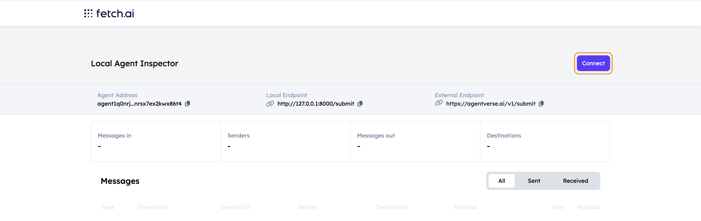
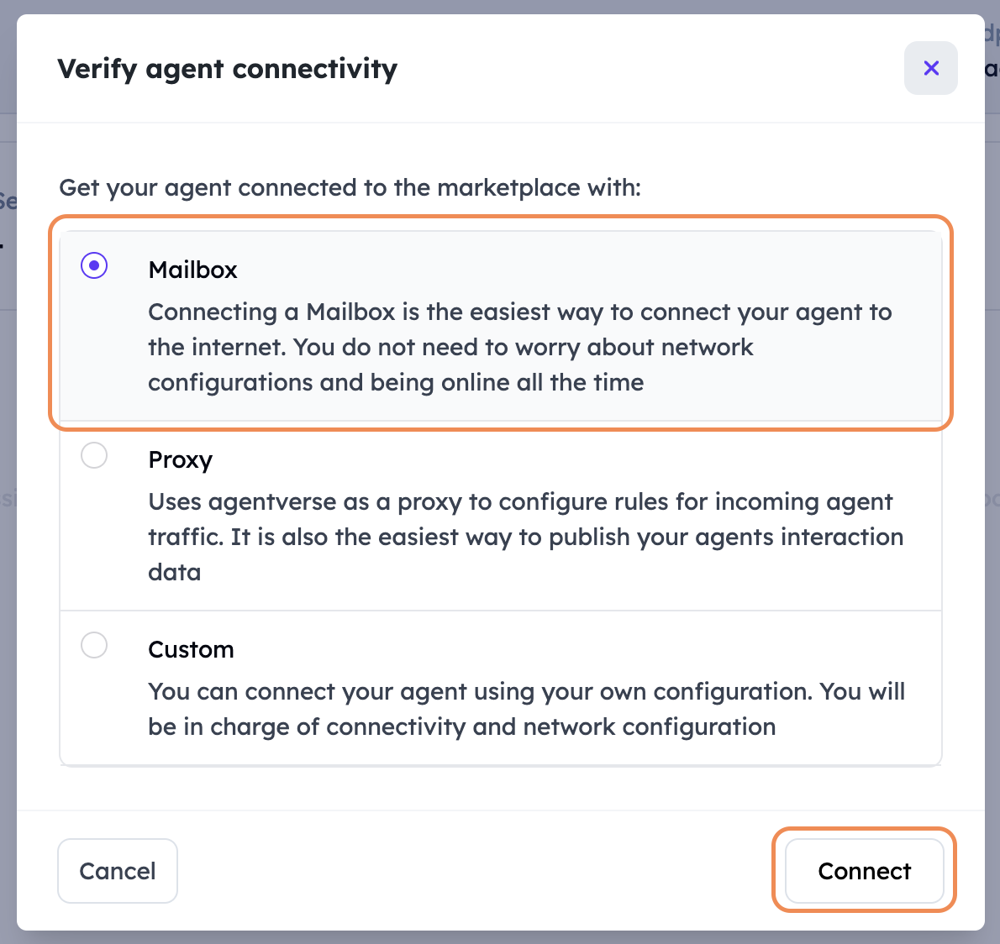
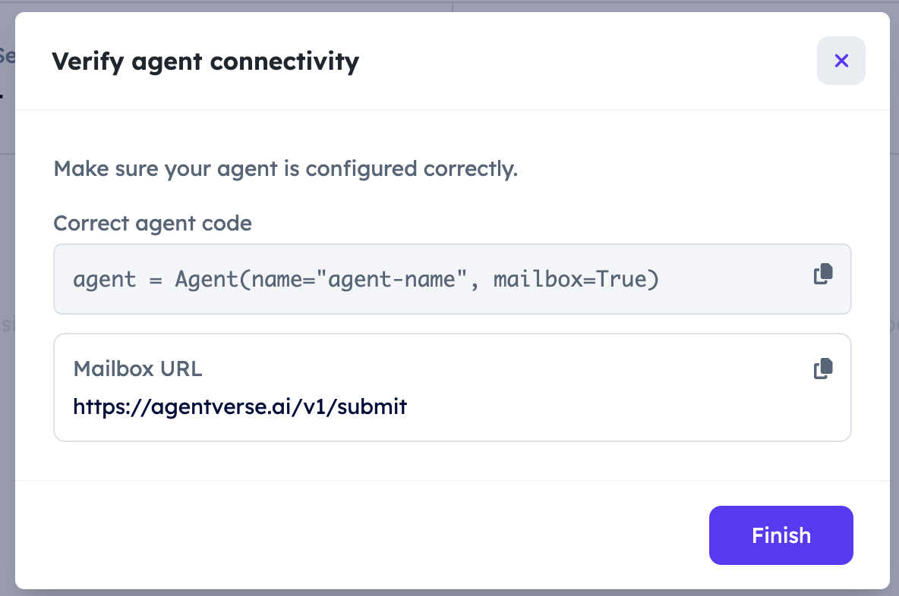
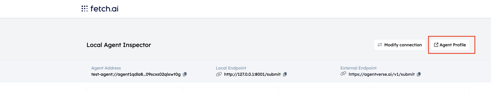
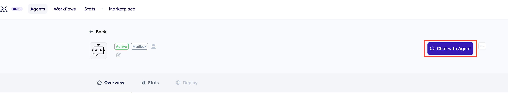
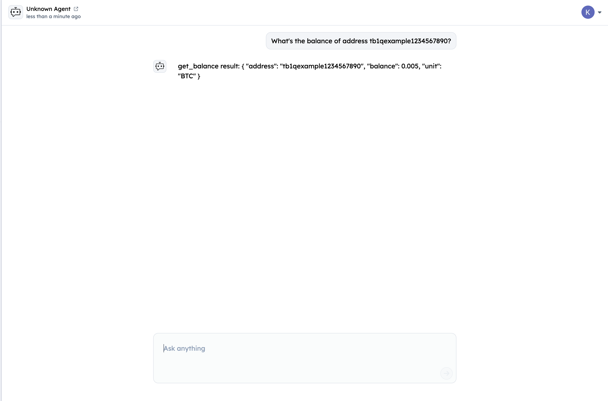
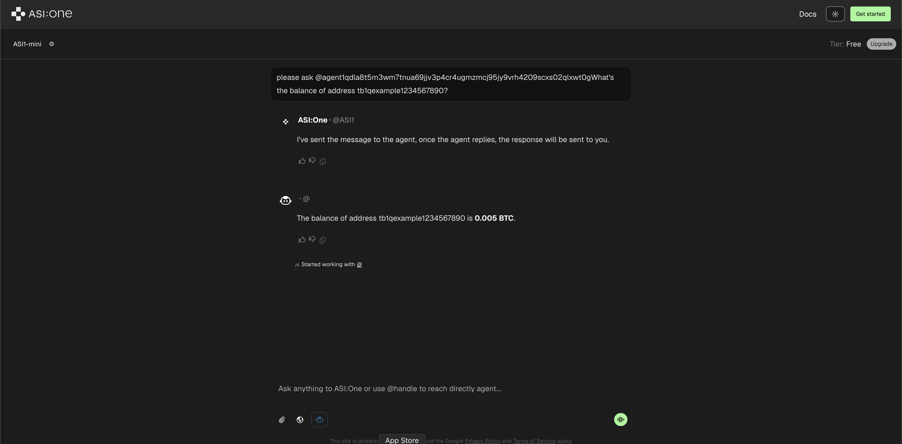

# Fetch.ai + ICP Integration:

This project demonstrates a collaborative integration between Internet Computer Protocol (ICP) and Fetch.ai, showcasing how to build a Bitcoin service using ICP canisters in the backend and Fetch.ai agents which can be queried via the AISI:One LLM.

## Project Structure

```
fetch-icp-integration/
├── fetch                    # Fetch.ai agent implementation
   ├── agent.py              # Fetch.ai agent implementation
   └── private_keys.json     # Private keys for the agent
└── ic/                      # ICP canister implementation
    └── src/
        └── backend/
            └── index.ts     # Dummy Bitcoin HTTP server
```

## Template and Codespace for Development

This project is set up as a **GitHub template** repository for easy development using **GitHub Codespaces**. To get started:

1. **Create your own repository**: Click the green **"Use this template"** button at the top of this repository page. This will create a new repository under your GitHub profile or organization with all the project files.

2. **Launch Codespace**: Once your repository is created, click the green **"Code"** dropdown button and select the **"Codespaces"** tab. Then click **"Create codespace on main"** to start a new development environment.

3. **Wait for setup**: The Codespace will automatically build and configure the development environment. This may take a few minutes as it installs all necessary dependencies and tools.

### Development Environment Configuration

The development environment is configured through two key files:

- **`.devcontainer/devcontainer.json`**: Defines the Codespace configuration including the base image, extensions, and port forwarding settings
- **`scripts/devcontainer-setup.sh`**: Contains the setup script that installs dependencies like DFX (DFINITY SDK), Node.js packages, and Python requirements

You can examine these files to understand how the environment is configured or to customize it for your specific needs.

## ICP Component

The ICP component (`ic/src/backend/index.ts`) implements a dummy HTTP server with the following endpoints:

- `/get-balance` - Returns dummy balance for a Bitcoin address
- `/get-utxos` - Returns dummy UTXOs for a Bitcoin address
- `/get-current-fee-percentiles` - Returns dummy fee percentiles
- `/get-p2pkh-address` - Returns a dummy P2PKH address

Note: This is a dummy implementation that returns mock data. The actual implementation needs to be amended.

You can call from the command line:

- curl http://[canisterId].localhost:4943/
- curl -X POST -H "Content-Type: application/json" -d "{ \"address\": \"[BTC Address]\" }" http://[canisterId].localhost:4943/get-balance

---

## IC Component

To set up and run the ICP canister locally, follow these steps:

1. **Click "Use Template" and create your own repository**

2. **Open project as a VS Code Codespace**
3. **Start up a local ICP replica with BTC Node:**

   ```bash
   dfx start --clean --enable-bitcoin --bitcoin-node 127.0.0.1:18444
   ```

4. **In a separate terminal, deploy your canister:**

   ```bash
   cd ic
   dfx deploy
   ```

5. **In the browser, open and interact with HTTP Server:**
   - URL: http://{canister backend id}.localhost:4943/ (see id from deploy message)

---

## Fetch.ai Component

The Fetch.ai component (`agent.py`) implements an intelligent agent using the Chat Protocol, making it discoverable by ASI:One. The agent:

- Processes natural language queries about Bitcoin operations
- Converts user queries into appropriate API calls to the ICP canister
- Define the ICP endpoints as functions with descriptions and required parameters in the agent.
- Use a LLM to decide which endpoint needs to be called based on user query and the defined functions.
- Handles responses and presents them in a user-friendly format
- Supports various Bitcoin-related queries like checking balances, UTXOs, fees, and sending transactions

### Install uagents

```bash
pip install uagents
```

### Get Your ASI:One API Key

To use the agent, you need an ASI:One API Key. Follow these steps:

1. Go to [https://asi1.ai/](https://asi1.ai/)
2. Log in using your Google account or Fetch Wallet.
3. Navigate to **Workbench**.
4. Select **Developer** from the menu on the left.
5. Click on **Create New** to generate a new API key.
6. Copy the generated API key.
7. Open `agent.py` and set your API key in the following line:
   ```python
   ASI1_API_KEY = "YOUR_ASI1_API_KEY"  # Replace with your ASI1 key
   ```
8. Copy the cannister ID after deploying and replace the cannister ID in the `agent.py` file.

   ```bash
   Deployed canisters.
   URLs:
   Backend canister via Candid interface:
   backend: http://127.0.0.1:4943/?canisterId=umunu-kh777-77774-qaaca-cai&id=uzt4z-lp777-77774-qaabq-cai
   ```

   ```python
   CANISTER_ID = "uzt4z-lp777-77774-qaabq-cai"
   BASE_URL = "http://127.0.0.1:4943"
   ```

9.

### Running the Agent

1. In a separate terminal, start the agent:

```bash
cd fetch
./venv/bin/python agent.py
```

or through npm

```bash
npm run agent
```

2. The agent will start and display its address and inspector URL:

```
INFO: [test-ICP-agent]: Starting agent with address: agent1qdla8t5m3wm7tnua69jjv3p4cr4ugmzmcj95jy9vrh4209scxs02qlxwt0g
INFO: [test-ICP-agent]: Agent inspector available at https://agentverse.ai/inspect/?uri=http%3A//127.0.0.1%3A8001&address=agent1qdla8t5m3wm7tnua69jjv3p4cr4ugmzmcj95jy9vrh4209scxs02qlxwt0g
```

3. Click on the Agent Inspector link to connect the agent with Agentverse via Mailbox
   





4. Test the agent using the Chat interface with queries like:
   - Once connected, click on Agent Profile
     

   - Click on `Chat with Agent` to test the flow
     

   - Type in your queries in the UI
     

   - Query through ASI:One
     

## Example Queries

The agent supports various types of queries:

### Balance Queries

- What's the balance of address bc1q8sxznvhualuyyes0ded7kgt33876phpjhp29rs?
- Can you check how many bitcoins are in bc1q8sxznvhualuyyes0ded7kgt33876phpjhp29rs?

### UTXO Queries

- What UTXOs are available for address bc1q8sxznvhualuyyes0ded7kgt33876phpjhp29rs?
- List unspent outputs for bc1q8sxznvhualuyyes0ded7kgt33876phpjhp29rs

### Fee Queries

- What are the current Bitcoin fee percentiles?
- Show me the latest fee percentile distribution
